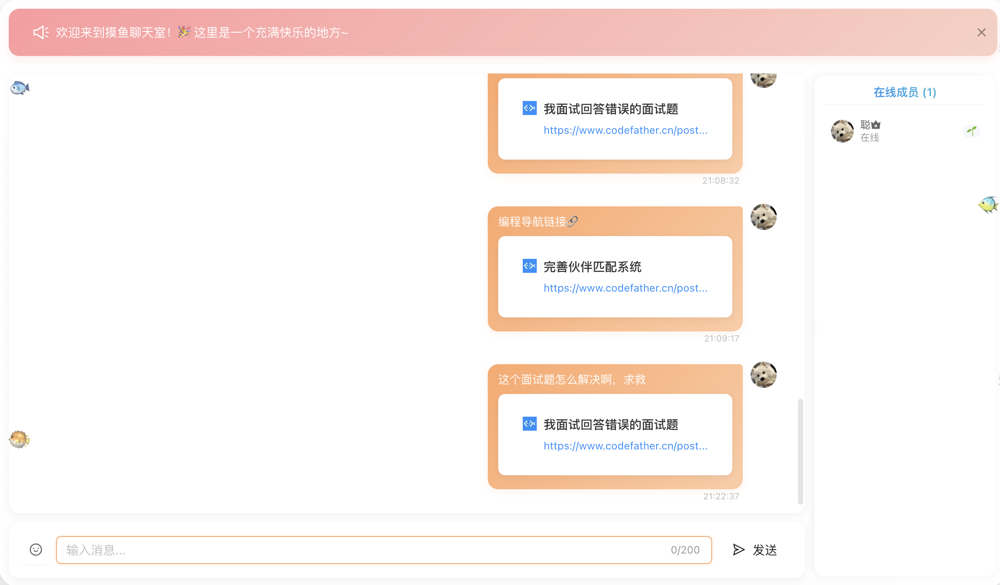
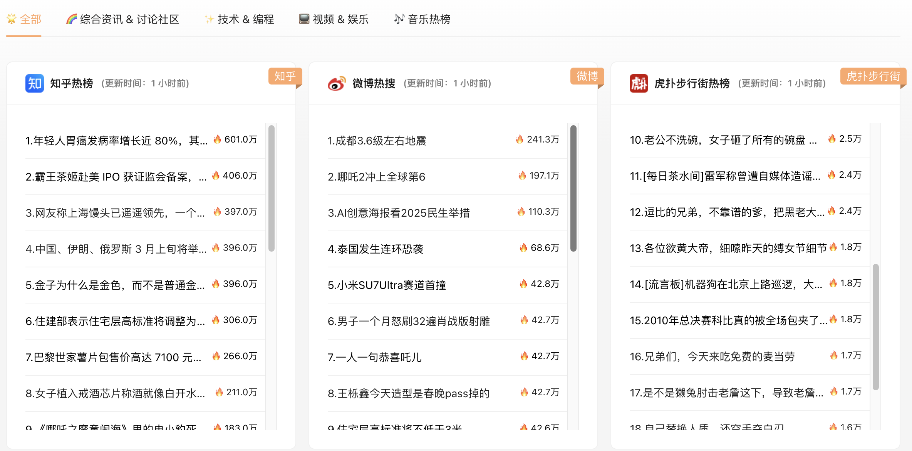
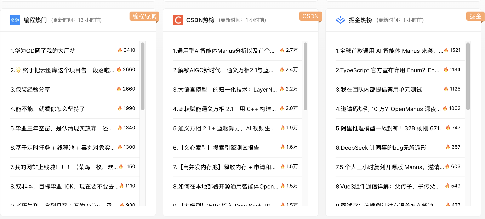
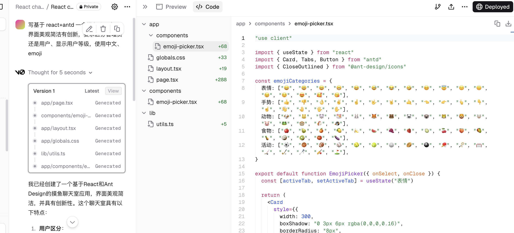
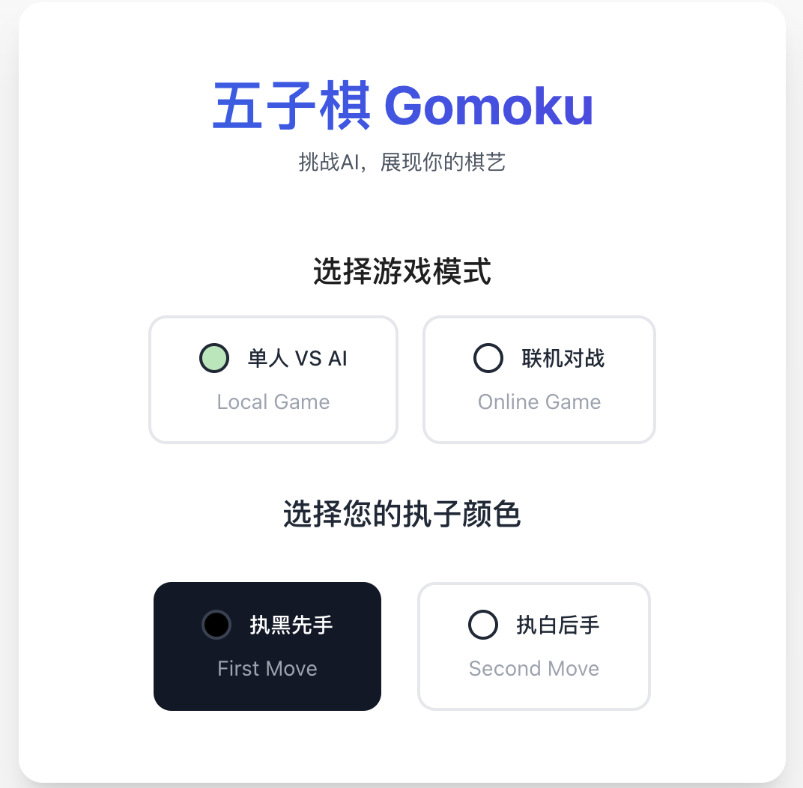
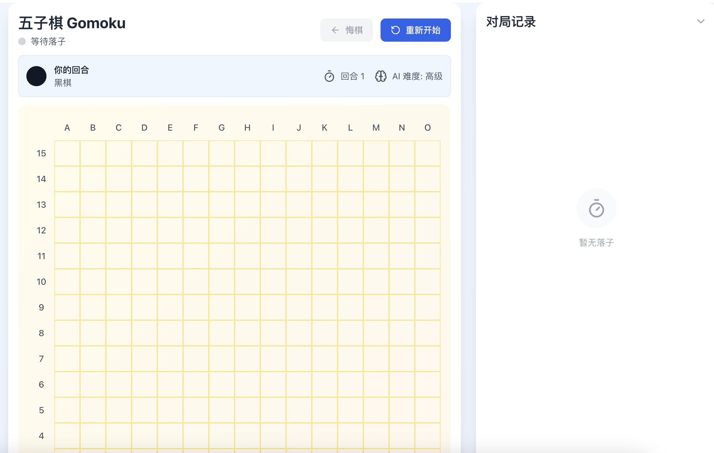
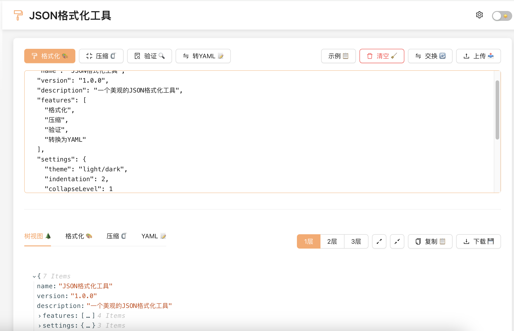
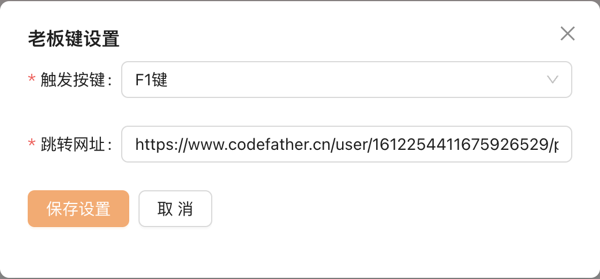

## 前言
最新写了个摸鱼网站：https://fish.codebug.icu/ （项目作为开源项目只是个人兴趣不作为任何盈利，有需要的朋友可以直接拿来作为自己的小项目）

由于个人非常喜欢摸鱼的时候了解一下实时信息，看了市面上挺多的信息聚合网站觉得挺有意思，我也学习来写一下，写着写着发现诶！还真挺有意思，于是便有了我的 摸鱼小网站===》摸鱼岛🐟。

## 项目开源

项目技术栈⬇️：

前端技术栈：React 、 Antd 、 json-viewer 、aj-captcha-react

后端技术栈：SpringBoot 、 MySQL 、 Redis 、 Netty 、 WebSocket、JSOUP 爬虫

在线体验地址🔗：https://fish.codebug.icu/

后端地址🌈：https://github.com/lhccong/fish-island-backend

前端地址🏖️：https://github.com/lhccong/fish-island-frontend

## 项目功能

### 摸鱼群聊

这个功能也是编程导航的🐟友提的意见，一开始是不打算走的，后面看见许多人都想要这个功能就加上了，编程导航 ➕ 摸鱼聊天，美滋滋，不会的技术直接提问、推荐的 B 站视频直接分享，大家一起学习摸鱼，共同进步。




### 聚合信息源 🌈

项目聚合了市面上比较常见的信息源：如编程导航、知乎、微博、网易云等信息源热榜，后端使用了爬虫➕直接请求接口获取数据等操作，来进行数据源的爬取，通过 Redis + 信息压缩，提高了数据💡的返回速度（PS：开始 1s =》优化后 100ms 整整十倍）。在这里你能看到编程相关的以及娱乐相关的，学习娱乐两不误。





### 每日待办💡

这个也是我个人的需求，嘿嘿，我平时也需要每天列一下待办，如果我能在自己网站写下待办岂不美哉于是有了一下界面。


### 小游戏 🎮

小游戏呢目前有五子棋和 2048 ，这些小游戏都是 AI 帮我写的，推荐两个 AI 页面生成网站（https://v0.dev/chat 、https://bolt.new/），只需要将你的需求发给他即可生成你想要的界面以及帮你自动部署在线网站喔。



#### 五子棋

五子棋支持与 AI 对战、与朋友在线对战（只需要创建房间，把房间号发给好友就可以啦，我跟朋友经常偷偷对战😊）



五子棋对战效果如下⬇️：



#### 2048


### 工具箱🔧

#### JSON 格式化工具

由于身为一个程序猿，经常需要 JSON 格式化来格式数据，我在想能不能让 AI 给我写一个 JSON 格式化工具呢，于是有了一下界面⬇️：



### 老板键

有挺多小伙伴总是害怕上班被老板发现，于是我开发了老板键，老板键有以下两种方式⬇️：

- 普通方式：

  通过界面配置自定义快捷键跳转。

  

- 隐藏方式（此方式不是页面跳转，而是自定义图片显示）：

  按住 Ctrl + Shift + B 可以快速打开老板键【再 Ctrl + Shift + S 打开设置页面自定义老板页面喔！】

## 开源与贡献

### 📌 贡献方式

如果你也有希望聚合的数据源不妨来参加一下贡献，将你的数据源爬取出来放入其中。

#### 1️⃣ 页面元素抓取

📌 **适用于**：目标网站未提供 API，数据嵌入在 HTML 结构中。

##### ✅ 贡献要求

- **推荐使用**：
  - `Jsoup`（Java）
  - `BeautifulSoup`（Python）
  - `Cheerio`（Node.js）
- **选择器精准**：避免因页面结构变化导致抓取失败。
- **减少 HTTP 请求**：优化抓取效率，避免重复请求。
- **遵守网站爬取规则**（`robots.txt` ）。

##### 💡 示例代码

```java
Document doc = Jsoup.connect("https://example.com").get();
String title = doc.select("h1.article-title").text();
```

---

#### 2️⃣ 页面接口返回数据抓取

📌 **适用于**：目标网站提供 API，可直接调用接口获取 JSON/XML 数据。

##### ✅ 贡献要求

- **推荐使用**：
  - `HttpClient`（Java）
  - `axios`（Node.js）
  - `requests`（Python）
- **分析 API 请求**：确保请求参数完整（`headers`、`cookies`、`token`）。
- **减少不必要的请求**：优化调用频率，避免触发反爬机制。
- **异常处理**：确保代码稳定运行。

##### 💡 示例代码

```java
String apiUrl = "https://api.example.com/data";
String response = HttpRequest.get(apiUrl).execute().body();
JSONObject json = JSON.parseObject(response);
```

---

### 🔗 数据源注册

数据抓取完成后，需要注册数据源，以便系统能够正确使用。

##### 🚀 注册流程

1. **添加数据源 Key**：
   `/src/main/java/com/cong/fishisland/model/enums/HotDataKeyEnum.java` 定义新的数据源 Key。

2. **更新数据源映射**：

  -  `/src/main/java/com/lhccong/fish/backend/config/DatabaseConfig.java` 文件中，添加新的数据源配置。

3. **创建数据源类**：

  -  `src/main/java/com/cong/fishisland/datasource` 目录下，新建数据源类，继承 `DataSource`，实现 `getHotPost` 方法。

4. **实现数据获取逻辑**：

  - 按照 `HotPostDataVO` 格式返回数据。
  - 使用 `@Builder` 注解，确保数据能正确解析。

##### 💡 示例代码

```java
HotPostDataVO.builder()
            .title(title)
            .url(url)
            .followerCount(followerCount)
            .excerpt(excerpt)
            .build();
```

---

### 🚀 贡献流程

1. **Fork 仓库** ➜ 点击 GitHub 右上角 `Fork` 按钮。
2. **创建分支** ➜ 推荐使用有意义的分支名，如 `feature/data-scraper-optimization`。
3. **提交代码** ➜ 确保代码可读性高，符合规范。
4. **提交 Pull Request（PR）** ➜ 详细描述您的更改内容，并关联相关 issue（如有）。
5. **等待审核** ➜ 维护者会进行代码审核并合并。

以上讲解如果对你有帮助，不妨给我的项目点个小小的 star 🌟，成为一下我的精神股东呢
